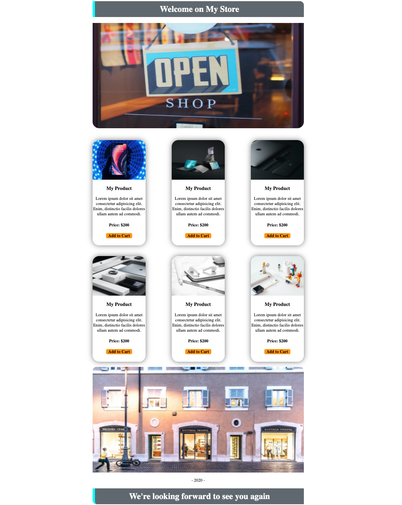

# Welcome on My Store #

With this task you're gonna cover the topics below:

- `text-align: center`
- `margin`
- Pseudo classes ( `>` and `,` )
- ``
- `
`
- headers
- `
`
- `backgrounf-color`
- `color`
- borders with all options
- `box-shadow`
- hyper links

## What you should do? ##

You should try to create as same website as below.

Also you should create another HTML file for the basket

**You'd need images!**

Please click the links of images below and copy image addresses to use in your project.
PS: Image adreeses did not directly given due to practice having image links.

- [Header](https://images.unsplash.com/photo-1472851294608-062f824d29cc?ixlib=rb-1.2.1&ixid=eyJhcHBfaWQiOjEyMDd9&auto=format&fit=crop&w=1050&q=80)
- [First Product](https://images.unsplash.com/photo-1512499617640-c74ae3a79d37?ixlib=rb-1.2.1&ixid=eyJhcHBfaWQiOjEyMDd9&auto=format&fit=crop&w=966&q=80)
- [Second Product](https://images.unsplash.com/photo-1593642632505-1f965e8426e9?ixlib=rb-1.2.1&ixid=eyJhcHBfaWQiOjEyMDd9&auto=format&fit=crop&w=925&q=80)
- [Third Product](https://images.unsplash.com/photo-1550029402-226115b7c579?ixlib=rb-1.2.1&ixid=eyJhcHBfaWQiOjEyMDd9&auto=format&fit=crop&w=701&q=80)
- [Fourth Product](https://images.unsplash.com/photo-1491933382434-500287f9b54b?ixlib=rb-1.2.1&ixid=eyJhcHBfaWQiOjEyMDd9&auto=format&fit=crop&w=700&q=80)
- [Fifth Product](https://images.unsplash.com/photo-1516163109866-e9d98630a0a6?ixlib=rb-1.2.1&ixid=eyJhcHBfaWQiOjEyMDd9&auto=format&fit=crop&w=1050&q=80)
- [Sixth Product](https://images.unsplash.com/photo-1572797258555-4f33f86f443f?ixlib=rb-1.2.1&ixid=eyJhcHBfaWQiOjEyMDd9&auto=format&fit=crop&w=1048&q=80)
- [Footer](https://images.unsplash.com/photo-1542581509-7e87190743b6?ixlib=rb-1.2.1&ixid=eyJhcHBfaWQiOjEyMDd9&auto=format&fit=crop&w=1050&q=80)

**One more thing!**

You're aloud to have just one class.

**So please try to use *pseudo classes.***

